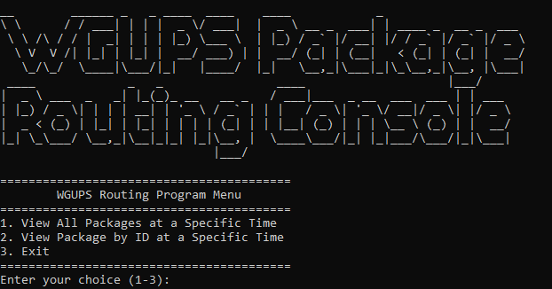

# WGUPS Routing — C950 DSA II

Lightweight WGUPS routing simulator used for WGU C950. Simulates three trucks delivering 40 packages using CSV inputs and a nearest-neighbor heuristic approach.

## Contents
- Input Files:
  - `./Input Files/WGUPS Package File.csv`
  - `./Input Files/WGUPS Distance File.csv`
- Key code:
  - `main.py` — simulation entrypoint and routing logic
  - `truck.py`, `package.py`, `address.py`, `hashmap.py` — domain models & helpers

## Requirements
- Python 3.8+
- Recommended (Windows):
  - python -m venv venv
  - .\venv\Scripts\activate
  - pip install -r requirements.txt (if you add one)

## Run
- From project root:
  - python main.py
- Or call the simulator directly from a REPL:
  - from datetime import datetime
  - from main import simulate_truck_deliveries
  - simulate_truck_deliveries(datetime(2020, 1, 1, 16, 0, 0))  # run to EOD snapshot

## How it works (brief)
1. Parse packages and distances into an address index and symmetric distance matrix.
2. Apply special rules:
   - Mark delayed packages (IDs 6, 25, 28, 32).
   - If the simulation snapshot time is after 10:20, update package 9's address.
3. Assign package lists to the three trucks (lists in `simulate_truck_deliveries`).
4. For truck 1 and 2 (then truck 3 after conditions), repeatedly:
   - Use `_find_nearest_delivery` (nearest neighbor) to select next stop.
   - Compute travel time using TRUCK_SPEED (18 mph).
   - Update package status, truck mileage, and times. Support partial-leg snapshots.
5. When a truck finishes, return it to HUB and add return miles.

## Common issues & fixes
- Packages 39 and 40 not delivered:
  - Ensure they are assigned to a truck that departs early enough (commonly `t1_ids`). Example fix: include `39, 40` in `t1_ids` in `simulate_truck_deliveries`.
- High total mileage:
  - Check package groupings across trucks — grouping geographically reduces cross-routing.
  - Improve nearest-neighbor by prioritizing deadlines or clustering (see `_find_nearest_delivery`).
  - Verify return-to-hub miles are added exactly once per finished truck.
- Snapshot/partial-leg behavior:
  - Partial-leg logic in `simulate_truck_deliveries` adds only the fraction of miles up to the snapshot. Confirm snapshot comparison uses datetimes consistently.

## Debugging tips
- Add short debug prints where miles are added to verify per-leg accumulation:
  - Print truck id, from -> to, leg miles, running total.
- Validate distance lookups:
  - Confirm `address_index[street]` returns the expected index for every package address string used.
- Confirm 10:20 rule:
  - The code should compare `end_time` against `datetime(2020,1,1,10,20,0)` and update package 9 only when `end_time > that datetime`.

## Notes
- Nearest-neighbor is a heuristic: results depend strongly on initial package distribution among trucks.
- This project is intentionally simple for the assignment; more advanced routing (2-opt, simulated annealing, or full TSP solvers) will reduce miles further.

## Contact / Next steps
- To get mileage under the target, try:
  - Re-balance package lists across trucks to cluster addresses.
  - Enhance `_find_nearest_delivery` to prefer deadline packages and small lookahead clustering.
  - Add per-leg debug output to trace mileage.